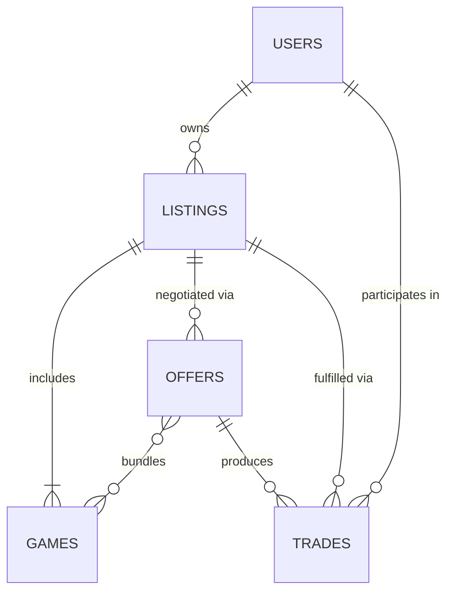
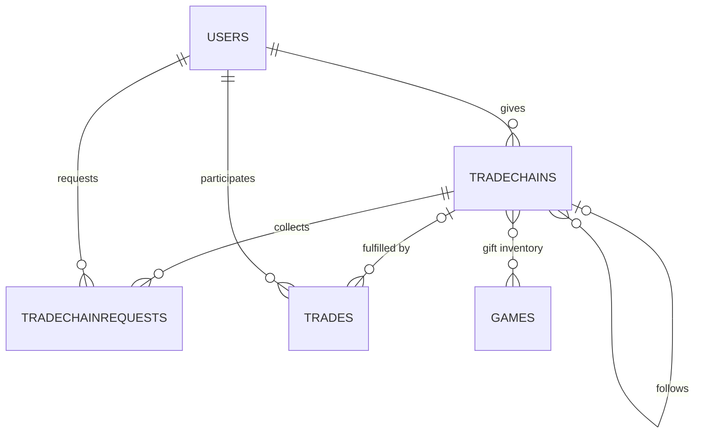
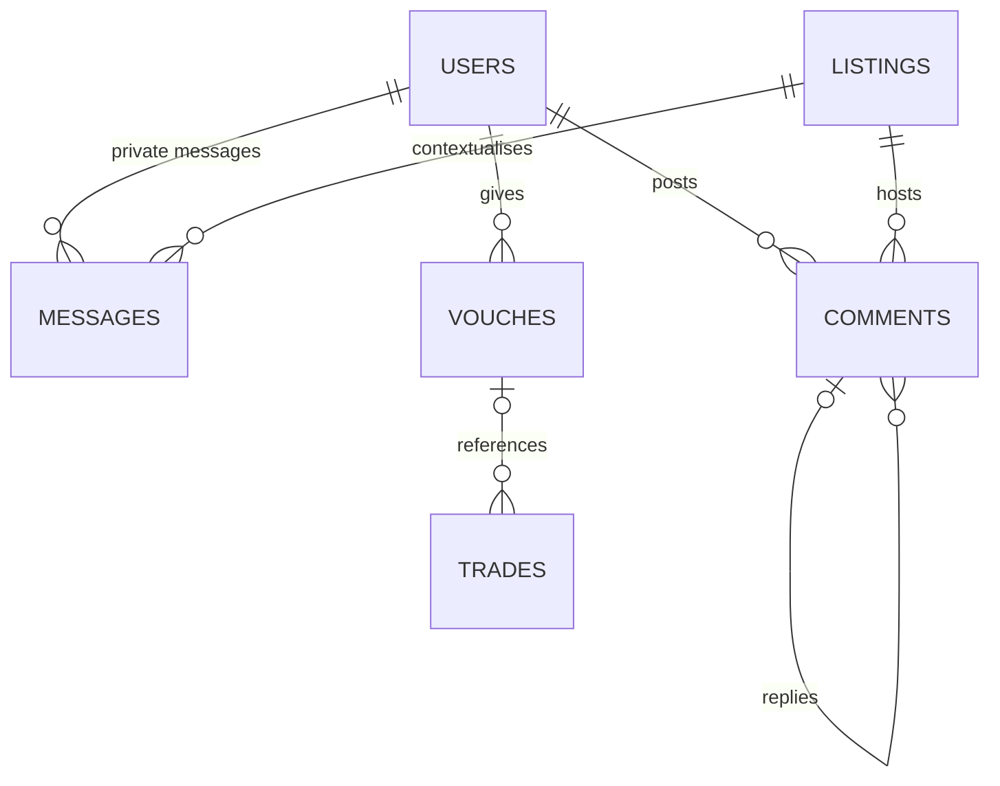
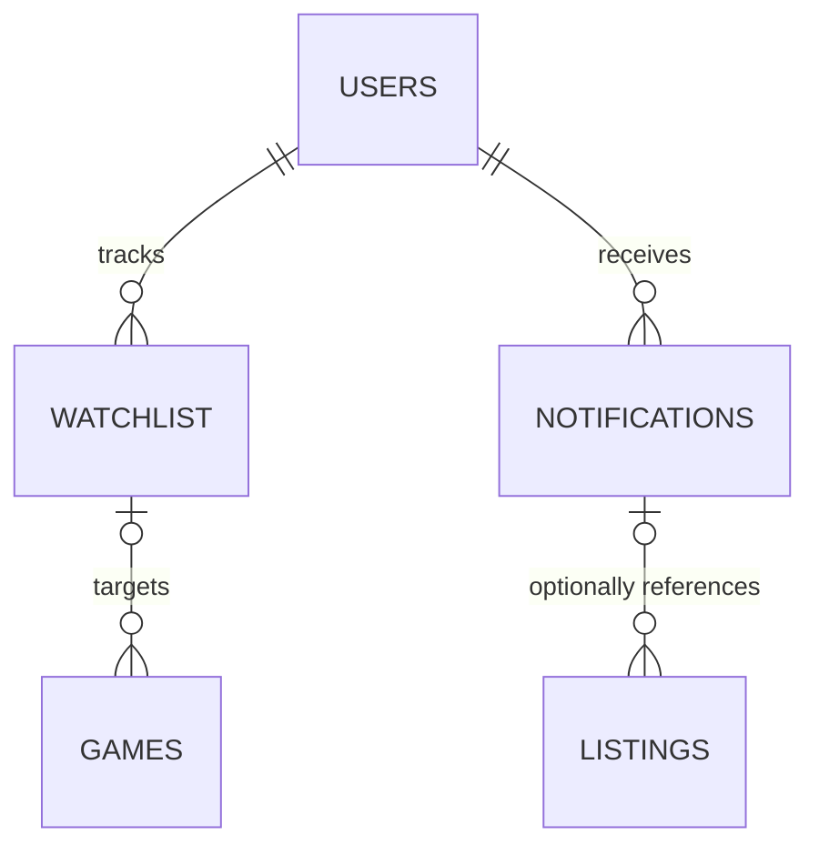

# PocketBase Data Models

Meeple Cart stores its operational data inside PocketBase. The entities below represent the core marketplace concepts: users publish listings for board games, negotiate offers that can mature into trades, and build trust through vouches and notifications.

## Collections

### Core identities

#### Users (`users`)

| Field                | Type   | Notes                                             |
| -------------------- | ------ | ------------------------------------------------- |
| `display_name`       | text   | Public profile name (required)                    |
| `location`           | text   | Optional free-form location                       |
| `phone`              | text   | Optional; validated against international pattern |
| `trade_count`        | number | Running tally of completed trades                 |
| `vouch_count`        | number | Aggregate count of vouches received               |
| `joined_date`        | date   | Registration timestamp                            |
| `bio`                | text   | Long-form profile description                     |
| `preferred_contact`  | select | One of `platform`, `email`, or `phone`            |
| `notification_prefs` | json   | Structured preferences for delivery channels      |

### Trading workflow

#### Listings (`listings`)

Listings capture each marketplace offering.

| Field                | Type               | Notes                                              |
| -------------------- | ------------------ | -------------------------------------------------- |
| `owner`              | relation → `users` | Author of the listing (required)                   |
| `title`              | text               | Public title shown in feeds                        |
| `listing_type`       | select             | `sell`, `trade`, or `sell_and_trade`               |
| `status`             | select             | Tracks workflow (`draft`, `published`, `archived`) |
| `summary`            | text               | Markdown-friendly description                      |
| `location`           | text               | Pickup location string                             |
| `shipping_available` | bool               | Indicates shipping support                         |
| `prefer_bundle`      | bool               | Highlights bundle preference                       |
| `bundle_discount`    | number             | Optional percent discount for bundles              |
| `views`              | number             | PocketBase-managed counter                         |
| `bump_date`          | date               | Next time the listing surfaces to the top          |
| `photos`             | file (multiple)    | Uploaded gallery assets                            |

#### Games (`games`)

Each listing may include multiple game entries that carry pricing and condition details.

| Field           | Type                  | Notes                                            |
| --------------- | --------------------- | ------------------------------------------------ |
| `listing`       | relation → `listings` | Parent listing (cascade delete)                  |
| `bgg_id`        | number                | BoardGameGeek identifier                         |
| `title`         | text                  | Game title override                              |
| `year`          | number                | Publication year                                 |
| `condition`     | select                | Values such as `new`, `like_new`, `used`, `poor` |
| `price`         | number                | Cash asking price                                |
| `trade_value`   | number                | Implied value for trade negotiations             |
| `notes`         | text                  | Additional condition notes                       |
| `status`        | select                | Availability status (`active`, `reserved`, etc.) |
| `photo_regions` | json                  | Image crop metadata                              |
| `price_history` | json                  | Array of price adjustments over time             |

#### Offers (`offers`)

Offers replace the direct jump from inquiry to trade by tracking the negotiation round-trip. They reference a listing, the proposing user, and the bundle of games involved. By design, both the buyer and seller must accept before fulfillment can begin.

| Field           | Type                  | Notes                                                                                                                        |
| --------------- | --------------------- | ---------------------------------------------------------------------------------------------------------------------------- |
| `listing`       | relation → `listings` | Context of the offer (required)                                                                                              |
| `proposer`      | relation → `users`    | User initiating the offer (required)                                                                                         |
| `status`        | select                | Workflow states such as `draft`, `sent_to_seller`, `seller_accepted`, `buyer_accepted`, `declined`, `cancelled`, `completed` |
| `buyer_status`  | select                | Mirrors buyer-side actions (`pending`, `accepted`, `declined`, `sent`, `received`, `cancelled`)                              |
| `seller_status` | select                | Mirrors seller-side actions (`pending`, `accepted`, `declined`, `sent`, `received`, `cancelled`)                             |
| `notes`         | text                  | Supplemental negotiation context                                                                                             |
| `expires_at`    | date                  | Optional deadline after which the offer auto-expires                                                                         |
| `games`         | m2m → `games`         | PocketBase join table managed automatically to associate offered games                                                       |

An offer transitions to fulfillment when both sides reach the `accepted` state. After acceptance, the `sent` and `received` statuses capture shipping acknowledgements from each party.

#### Trades (`trades`)

Represents the negotiated outcome once an accepted offer moves to fulfillment. Trades are created automatically from offers; there is no standalone “pending” phase outside the offer workflow. When a gift chain step moves into fulfillment, the resulting trade links back to that step so shipping updates can be tracked without duplicating chain state.

| Field            | Type                      | Notes                                                             |
| ---------------- | ------------------------- | ----------------------------------------------------------------- |
| `listing`        | relation → `listings`     | Listing that resulted in the trade                                |
| `offer`          | relation → `offers`       | Accepted offer that spawned the trade                             |
| `recipient`      | relation → `users`        | Recipient account                                                 |
| `sender`         | relation → `users`        | Sender account                                                    |
| `chain_step`     | relation → `trade_chains` | Optional chain step this trade fulfills                           |
| `status`         | select                    | Flow states (`in_transit`, `delivered`, `completed`, `cancelled`) |
| `rating`         | number                    | Optional star rating                                              |
| `review`         | text                      | Free-form feedback                                                |
| `completed_date` | date                      | When the trade was finalized                                      |

### Chain coordination

Trade chains coordinate linear “pay it forward” exchanges. Each record in `trade_chains` represents a single step: a current giver lists the specific game bundle they are sending, invites interest, selects the next recipient, and dispatches the gift so the chain can continue.

#### Trade Chains (`trade_chains`)

| Field               | Type                        | Notes                                                                                                                                 |
| ------------------- | --------------------------- | ------------------------------------------------------------------------------------------------------------------------------------- |
| `giver`             | relation → `users`          | User responsible for shipping the gift in this step                                                                                   |
| `title`             | text                        | Optional short label shown in feeds                                                                                                   |
| `root_step`         | relation → `trade_chains`   | Pointer to the first step in the sequence (self-reference)                                                                            |
| `previous_step`     | relation → `trade_chains`   | Prior step that handed the chain to this giver                                                                                        |
| `sequence`          | number                      | Position within the overall chain (root starts at 1)                                                                                  |
| `status`            | select                      | Lifecycle states (`draft`, `collecting_interest`, `selecting_recipient`, `awaiting_dispatch`, `in_transit`, `fulfilled`, `cancelled`) |
| `selection_method`  | select                      | How the next recipient is chosen (`manual`, `lottery`, `first_come`)                                                                  |
| `description`       | text                        | Optional long-form explanation of the gift or theme                                                                                   |
| `games`             | m2m → `games`               | The specific games included in this gift bundle                                                                                       |
| `selected_interest` | relation → `chain_interest` | The interest record chosen to receive the current gift                                                                                |
| `interest_deadline` | date                        | Cutoff for accepting new requests in this step                                                                                        |
| `trade`             | relation → `trades`         | Fulfillment trade created once shipping begins                                                                                        |
| `anonymous_giver`   | bool                        | Whether the giver wants their identity hidden from the recipient                                                                      |
| `resolved_at`       | date                        | When the step finished (fulfilled or cancelled)                                                                                       |
| `notes`             | text                        | Internal coordination notes for moderators                                                                                            |

The `selection_method` dictates how moderators or automation pick the next recipient—for example, `manual` for curated choices, `lottery` for random draws, or `first_come` for FIFO selections.

#### Chain Interest (`chain_interest`)

| Field             | Type                      | Notes                                                                                 |
| ----------------- | ------------------------- | ------------------------------------------------------------------------------------- |
| `chain_step`      | relation → `trade_chains` | Step the interest belongs to                                                          |
| `requester`       | relation → `users`        | User hoping to receive the current gift                                               |
| `message`         | text                      | Pitch describing why they should be selected                                          |
| `status`          | select                    | Workflow (`pending`, `shortlisted`, `selected`, `declined`, `withdrawn`, `fulfilled`) |
| `selected_at`     | date                      | Timestamp when the giver picked this interest                                         |
| `fulfilled_trade` | relation → `trades`       | Trade that satisfied the request (mirrors `trade_chain.trade`)                        |
| `shipping_notes`  | text                      | Optional delivery constraints or address hints                                        |

Typical flow:

1. A chain step is created in `collecting_interest`.
2. Interested users submit requests (`pending`).
3. The giver shortlists candidates, selects one, and transitions the step to `awaiting_dispatch`.
4. When the shipment begins, a trade is created and attached to the step; the status advances to `in_transit` and later `fulfilled` once delivery is confirmed.
5. The recipient then creates the next step, linking it through `previous_step`/`root_step`, and the process repeats until moderators resolve the chain or no further participants step forward.

### Social & engagement

#### Messages (`messages`)

Private conversations between buyers and sellers.

| Field       | Type                  | Notes                                        |
| ----------- | --------------------- | -------------------------------------------- |
| `listing`   | relation → `listings` | Conversation context                         |
| `thread_id` | text                  | Stable identifier for conversation threading |
| `sender`    | relation → `users`    | Message author                               |
| `recipient` | relation → `users`    | Intended recipient (system enforces auth)    |
| `content`   | text                  | Markdown-supported body                      |
| `read`      | bool                  | Read receipt flag                            |

#### Comments (`comments`)

Public discussion threads hosted on listings. Comments allow community members to clarify listing details without entering the private offer flow.

| Field            | Type                  | Notes                                                     |
| ---------------- | --------------------- | --------------------------------------------------------- |
| `listing`        | relation → `listings` | Listing the comment is attached to                        |
| `author`         | relation → `users`    | Comment creator                                           |
| `content`        | text                  | Markdown-supported body                                   |
| `parent_comment` | relation → `comments` | Optional pointer enabling threaded replies                |
| `visibility`     | select                | Moderation state such as `published`, `hidden`, `removed` |
| `created_at`     | date                  | Timestamp when the comment was submitted                  |

#### Vouches (`vouches`)

Trust signals exchanged after successful trades.

| Field     | Type                | Notes                                                             |
| --------- | ------------------- | ----------------------------------------------------------------- |
| `voucher` | relation → `users`  | User providing the vouch                                          |
| `vouchee` | relation → `users`  | User receiving the vouch                                          |
| `message` | text                | Short testimonial                                                 |
| `created` | date                | Timestamp of the vouch                                            |
| `trade`   | relation → `trades` | Optional reference to the fulfilled trade that inspired the vouch |

### Discovery & alerts

#### Watchlist (`watchlist`)

Search agents that notify a user about new matches. Watchlist entries primarily reference a game (or prospective game via `bgg_id`) instead of a specific listing so that alerts survive listing churn.

| Field          | Type               | Notes                                         |
| -------------- | ------------------ | --------------------------------------------- |
| `user`         | relation → `users` | Owner of the watchlist entry (cascade delete) |
| `game`         | relation → `games` | Optional pointer to a specific game record    |
| `bgg_id`       | number             | BoardGameGeek game identifier to watch        |
| `max_price`    | number             | Upper bound for listings                      |
| `max_distance` | number             | Maximum pickup radius in kilometers           |

#### Notifications (`notifications`)

System alerts delivered to users.

| Field     | Type                  | Notes                                                                         |
| --------- | --------------------- | ----------------------------------------------------------------------------- |
| `user`    | relation → `users`    | Recipient (cascade delete)                                                    |
| `type`    | select                | Event category (`new_listing`, `new_message`, `price_drop`, `listing_update`) |
| `title`   | text                  | Short headline                                                                |
| `message` | text                  | Optional supporting copy                                                      |
| `link`    | text                  | Deep-link to relevant UI                                                      |
| `listing` | relation → `listings` | Optional target listing                                                       |
| `read`    | bool                  | Tracks whether the user has acknowledged the notification                     |

## Updating the schema

1. Modify the PocketBase schema using the admin UI or migration scripts.
2. Export the latest schema snapshot to `services/pocketbase/schema/pb_schema.json`.
3. Create a corresponding auto-migration with `./pocketbase/pocketbase migrate diff` and commit the resulting file under `services/pocketbase/migrations/`.
4. Update these docs if relationships or key fields change.
