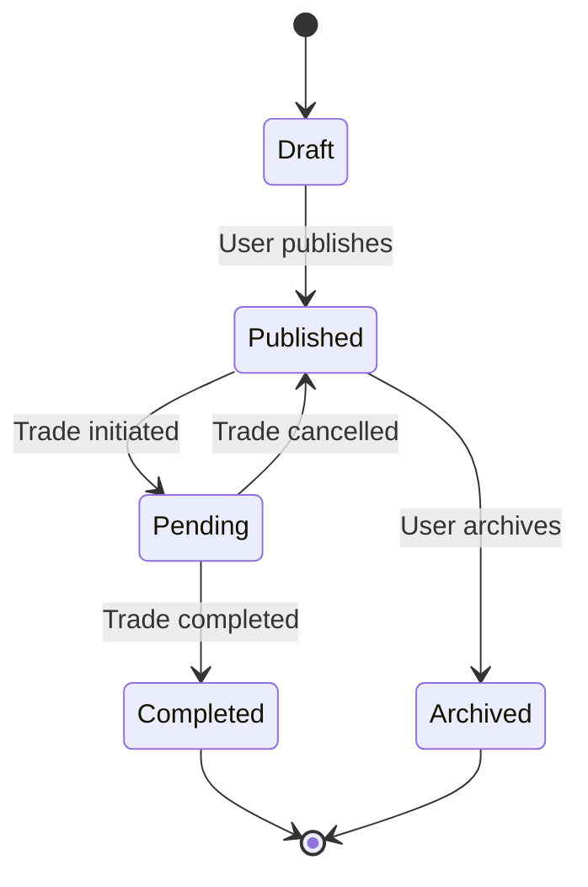

# Listings & Marketplace Mechanics

## Overview

Listings are the core of the Meeple Cart marketplace. Each listing represents one or more board games that a user wants to trade, sell, or acquire.

## Listing Types

| Type | Icon | Description | Required Fields |
|------|------|-------------|-----------------|
| **Trade** | 🔄 | Looking to trade games | Games offered, optional wants |
| **Sell** | 💰 | Looking to sell for cash | Games with prices |
| **Want to Buy** | 🎯 | Looking to acquire specific games | Desired games, budget/trade offers |

## Listing Lifecycle



### States

**Draft (Private)**
- Only visible to owner
- Can be edited freely
- Not searchable by others
- Used for preparing listings before going live

**Published (Listed)**
- Visible to all users in search/browse
- Appears in relevant searches and filters
- Can receive messages and trade requests
- Owner can edit details (photos, description, price)
- Listing type cannot be changed once published (Trade/Sell/Want is locked)

**Pending**
- Trade/offer has been accepted
- Games temporarily unavailable
- Listing remains visible but marked as "Pending"
- Can be cancelled back to Published if trade falls through

**Completed (Sold)**
- Trade successfully completed
- Games marked as traded/sold
- Listing archived but visible in trade history
- Can be used as reference for vouches

**Archived**
- User manually removed from active listings
- Not visible in search/browse
- Remains in user's history
- Can be re-published if desired (creates new listing with same details)

## Listing Visibility & Discovery

### Search & Browse

Listings appear in search results based on:
- Game titles (full-text search)
- Location proximity
- Listing type (trade/sell/want)
- Game condition
- Price range
- User trust tier (optional filter)

### Sorting Options

- **Recent**: Newest listings first (default)
- **Price: Low to High** (for sell listings)
- **Price: High to Low** (for sell listings)
- **Distance**: Closest to user's location first
- **Most Trusted**: Established/Trusted tier users first

### Filtering

Users can filter by:
- Listing type (trade/sell/want)
- Location (city, region, distance radius)
- Condition (new, like new, good, fair, poor)
- Shipping availability
- Bundle/single game
- Minimum trust tier (New, Seedling, Growing, Established, Trusted)

## Listing Bumping & Freshness

### Price Reduction Bumping

The **only** way to bump a listing to the top of search results:

**Price Reduction:**
- Reduce listing price by at least 10%
- Available once every **5 days**
- Listing gets new timestamp and moves to top of "Recent" sort
- Badge: "Price reduced 🔻"
- Shows old price with strikethrough: ~~$50~~ → $40

### Activity Badges (No Bumping)

These updates show badges but **do not** bump the listing to top:

**Significant Updates:**
- Add new games to listing (multi-game listings)
- Add shipping option where previously unavailable
- Update photos or description significantly
- Badge: "Updated ✨"
- Badge appears for 7 days after update

**Trade Activity:**
- When a game in a multi-game listing is traded
- Remaining games stay at current position
- Badge: "Recently traded"
- Shows trade activity without gaming search position

### Cooldown & Anti-Gaming

```typescript
interface BumpCooldown {
  last_price_reduction: timestamp;  // 5 day cooldown
  price_reduction_count: integer;   // Track frequency
  minimum_price_reduction: 0.10;    // 10% minimum
}

function canBumpWithPriceReduction(listing: Listing): boolean {
  const daysSinceLastReduction = getDaysSince(listing.last_price_reduction);
  return daysSinceLastReduction >= 5;
}

function validatePriceReduction(oldPrice: number, newPrice: number): boolean {
  const reduction = (oldPrice - newPrice) / oldPrice;
  return reduction >= 0.10; // At least 10% reduction
}
```

**Anti-gaming rules:**
- Can't repeatedly raise then lower prices (tracked in price_history)
- Minimum 10% reduction required
- 5-day cooldown between price reductions
- Multiple small reductions don't stack (must wait 5 days)
- Suspicious patterns (yo-yo pricing) flagged for review

### Price History Tracking

Every listing maintains a price history to track price changes over time and detect gaming patterns.

**Schema location:** `listings` collection → `price_history` field (JSON array)

For multi-game listings, price history is tracked per-game in the `games` collection → `price_history` field.

**Example structure:**

```javascript
// Single-game listing or top-level multi-game listing
listings.price_history: [
  {
    price: 50,
    changed_at: "2025-10-01T10:00:00Z",
    changed_by: "user_id",
    reason: "initial_listing"
  },
  {
    price: 45,
    changed_at: "2025-10-08T14:30:00Z",
    changed_by: "user_id",
    reason: "price_reduction_bump"
  },
  {
    price: 40,
    changed_at: "2025-10-15T09:15:00Z",
    changed_by: "user_id",
    reason: "price_reduction_bump"
  }
]

// Individual game within multi-game listing
games.price_history: [
  {
    price: 35,
    changed_at: "2025-10-01T10:00:00Z",
    changed_by: "user_id",
    reason: "initial_price"
  },
  {
    price: 30,
    changed_at: "2025-10-10T11:00:00Z",
    changed_by: "user_id",
    reason: "price_reduction"
  }
]
```

See [Data Models](./development/data-models.md) for complete schema details.

Display on listing:
```
Original price: $50 → Now $40 (20% off)
Price history: $50 (Oct 1) → $45 (Oct 8) → $40 (Oct 15)
```

### Future: Premium Bumping (Paid)

Potential future monetization option:

- **Highlighted Listing**: $2 for 7 days at top of results (marked as "Featured")
- **Regional Promotion**: $5 for 14 days, appears first in specific region
- **Category Feature**: $3 for 7 days in specific game category

Not implemented currently - focus is on organic, merit-based visibility.

## Listing Quality & Best Practices

### High-Quality Listings

Encouraged elements:
- Clear, descriptive titles
- Multiple photos from different angles
- Accurate condition descriptions
- Honest grading (using BGG standards)
- Responsive to messages
- Clear shipping/meetup options
- Bundle discounts for multi-game listings

### Quality Indicators

System shows quality signals:
- Photo count: "📷 5 photos"
- Response time: "Typically responds in 2 hours"
- Shipping: "📦 Shipping available"
- Bundle deals: "💸 10% bundle discount"
- Recent updates: "Updated 2 days ago"

### Low-Quality Listing Flags

Automatic warnings for:
- No photos (after 24 hours)
- No description or very short (<20 chars)
- No location specified
- Multiple price changes in short time
- Owner has low response rate (<50%)

These don't block publication but reduce visibility in search.

## Listing Analytics (Owner View)

Owners can see:
- Views count (total unique viewers)
- Messages received count
- Offers/trade requests count
- Days since last activity
- Search appearance count
- Average position in search results

Example:
```
Your Listing Performance

👁️ 127 views
💬 15 messages
📊 Appeared in 45 searches
⏱️ Last message: 2 days ago

Engagement rate: 12% (15 messages / 127 views)
This is above average! Keep it up.
```

## Listing Limits

**All users:**
- No limit on active listings
- No limit on listing type distribution
- No limit on games per listing

**Draft listings:**
- Auto-delete after 90 days of inactivity
- Warning at 60 days

**Archived listings:**
- Kept indefinitely in history
- Can be permanently deleted by owner

## Multi-Game Listings

### Overview

Multi-game listings allow sellers to list multiple games in a single listing, useful for collection liquidations, bundle deals, or sellers with many similar items.

### How They Work

**Structure:**
- One parent `listing` record
- Multiple child `games` records linked to the listing
- Each game has its own: title, condition, price, photos, BGG ID
- Listing can be: Trade (offering multiple games), Sell (bundle or individual), Want to Buy (seeking multiple titles)

**Example:**
```
Listing: "Board Game Collection Sale"
├─ Game 1: Wingspan ($40)
├─ Game 2: Scythe ($50)
├─ Game 3: Everdell ($35)
└─ Bundle discount: 10% if buying all three
```

### Partial Trades & Game Availability

**Scenario: One game from multi-game listing is traded**

1. **Before trade:**
   - Listing status: `Published`
   - Games: All marked as `available`
   - Listing visible in search

2. **Trade initiated for Wingspan:**
   - Wingspan status: `pending`
   - Other games (Scythe, Everdell): Still `available`
   - Listing remains `Published`
   - Search results show: "2 of 3 games available"

3. **Trade completed:**
   - Wingspan status: `sold`
   - Wingspan removed from active listing display
   - Listing auto-updates to show remaining games
   - Badge: "Recently traded" (doesn't bump listing)
   - Listing remains at current search position

4. **All games sold:**
   - When last game is traded → Listing auto-archives
   - Status: `Completed`
   - Visible in seller's trade history

### Pricing Strategies

**Individual pricing:**
```
Wingspan: $40
Scythe: $50
Everdell: $35
Total if separate: $125
```

**Bundle discount:**
```
Individual games: $40, $50, $35
Bundle price (all 3): $110 (12% off)
```

**Flexible bundles:**
```
Any 2 games: 5% off
All 3 games: 10% off
```

### Price Reduction Bumping for Multi-Game Listings

**Reduction applies to overall listing value:**

**Option 1: Reduce individual game prices**
- Original: Wingspan $40 + Scythe $50 + Everdell $35 = $125 total
- Reduced: Wingspan $35 + Scythe $45 + Everdell $30 = $110 total
- Total reduction: $15 / $125 = 12% ✓ (meets 10% minimum)
- Result: Listing bumped to top of search

**Option 2: Increase bundle discount**
- Original bundle: $110 (12% off individual prices)
- New bundle: $100 (20% off individual prices)
- Reduction: $10 / $110 = 9.1% ✗ (doesn't meet 10% minimum)
- Result: Listing NOT bumped (but "Updated ✨" badge shown)

**After partial sale:**
- If Wingspan sells, listing now contains Scythe + Everdell
- Remaining value: $85
- To bump: Must reduce by $8.50 (10% of $85)
- Example: Reduce to Scythe $40 + Everdell $30 = $70 total
- Reduction: $15 / $85 = 17.6% ✓

### Search & Discovery

**Multi-game listings appear in search when:**
- Any game in the listing matches search query
- Location/price filters match
- At least one game is still available

**Search result display:**
```
[Images of all available games]
────────────────────
Board Game Collection Sale
3 games: Wingspan, Scythe, Everdell
$110 for all (10% bundle discount)

By [Display Name] 🌳
Sell · Wellington · 5 days ago
```

**After partial sale:**
```
[Images of remaining games]
────────────────────
Board Game Collection Sale
2 games: Scythe, Everdell
$85 (Wingspan recently sold)

By [Display Name] 🌳
Sell · Wellington · 5 days ago
📦 Recently traded
```

### Best Practices

**For sellers:**
- Use clear bundle pricing (show savings percentage)
- Individual prices help buyers who only want some games
- Update photos when games sell (cross out sold items)
- Offer shipping discount for bundles
- Clear condition notes for each game

**For buyers:**
- Check which games are still available
- Ask if seller will split bundle (some may prefer all-or-nothing)
- Bundle deals = better value but less flexibility

### Vouching for Multi-Game Listings

**Vouches are tied to trades, not listings:**

- User A buys Wingspan from multi-game listing → 1 trade
- Trade completes → Both can vouch each other
- User A receives 1 vouch (if User B vouches) = 1 vouched trade toward tier progression

- Later, User C buys Scythe from same listing → separate trade
- Trade completes → Both can vouch each other
- Seller (User B) can receive another vouch = 2nd vouched trade

**Result:** Multi-game listings can result in multiple vouched trades for the seller (one per completed trade), helping build reputation faster for active sellers.

## Bulk Listing Tools (Future)

Planned features:
- CSV import from spreadsheet
- BGG collection import
- Duplicate listing creation (copy & modify)
- Batch status updates (publish/archive multiple)
- Template listings for frequent traders

## Related Documentation

- [Trust Tiers](./reputation/trust-tiers.md) - How trust tier affects listing visibility
- [Data Models](./development/data-models.md) - Listings schema details
- [Search & Discovery](#) - Advanced search mechanics (TODO)

---

**Status:** Core features documented, bumping mechanics defined, multi-game listings documented
**Last updated:** 2025-10-20
**Future sections to add:**
- Photo management & guidelines
- Condition grading standards
- Shipping & meetup coordination
