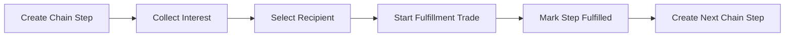

# Trade Chains Overview

Trade chains turn a single act of generosity into a cascading series of gifts. Each step in the chain follows a structured workflow managed inside PocketBase and surfaced through the SvelteKit frontend. This document explains the lifecycle, involved collections, and the user-facing experience so you can reason about the feature end-to-end.

## Goals

- Encourage community goodwill by letting givers surprise someone with a game and inviting them to “pay it forward”.
- Capture a transparent record of who gave, who received, and which games changed hands at every step.
- Provide moderators enough context to intervene when a chain stalls or abuse is suspected.

## Core concepts

- **Chain step (`trade_chains`)** – Represents a single hop. Stores the giver, the games being gifted, the interest submissions received, and the trade that fulfills the hop.
- **Interest submission (`chain_interest`)** – A would-be recipient’s pitch explaining why they should be chosen. The chain step picks exactly one submission before dispatching the gift.
- **Fulfillment trade (`trades`)** – Generated automatically when the giver initiates shipping. Tracks delivery status and provides a home for ratings or reviews if the community wants to respond.

Chains are linear by design: each fulfilled step spawns the next step. That next giver is usually the recipient from the previous hop, but moderators can insert additional steps or reassign if needed.

## Lifecycle

1. **Create step** – A giver creates a `trade_chains` record, attaches the games they plan to gift, and specifies a selection method plus deadline.
2. **Collect interest** – Community members submit `chain_interest` entries. Moderators can shortlist entries or mark them inappropriate.
3. **Select recipient** – Once the deadline passes (or earlier if manual selection), the giver picks a submission. The step transitions to `awaiting_dispatch`, and the chosen interest is stored as `selected_interest`.
4. **Dispatch gift** – When the giver ships the game, the app creates a new `trades` record linked via `chain_step`. The trade tracks sender/recipient, shipping progress, and optional feedback.
5. **Complete step** – Upon delivery confirmation, the step status moves to `fulfilled`.
6. **Continue chain** – The recipient (now the new giver) opens the next `trade_chains` step, referencing the previous step via `previous_step`. The sequence continues until the chain is voluntarily ended or moderators resolve it.

## Status reference

### `trade_chains.status`

| Status                | Meaning                                                         |
| --------------------- | --------------------------------------------------------------- |
| `draft`               | Step has not been announced; games or copy still in progress.   |
| `collecting_interest` | Interest submissions are open.                                  |
| `selecting_recipient` | Interest window closed; giver/moderators reviewing submissions. |
| `awaiting_dispatch`   | Recipient selected; awaiting shipment.                          |
| `in_transit`          | Trade created; shipment is on the way.                          |
| `fulfilled`           | Recipient confirmed receipt.                                    |
| `cancelled`           | Step aborted by giver or moderators.                            |

### `chain_interest.status`

| Status        | Meaning                               |
| ------------- | ------------------------------------- |
| `pending`     | Submitted and awaiting review.        |
| `shortlisted` | Highlighted as a strong candidate.    |
| `selected`    | Chosen to receive the gift.           |
| `declined`    | Not selected this round.              |
| `withdrawn`   | Requester retracted their submission. |
| `fulfilled`   | Gift delivered and acknowledged.      |

## Selection methods

The `selection_method` field informs both UI copy and automation:

- `manual` – Giver or moderator chooses any submission.
- `lottery` – System selects randomly from all eligible submissions once the deadline passes.
- `first_come` – First submission automatically wins; subsequent submissions may be auto-declined or shortlisted as alternates.

The frontend should tailor prompts, countdown timers, and CTAs based on the method to set expectations.

## Moderation touchpoints

- **Draft review** – Moderators can verify the games actually exist and the giver’s intent is legitimate before the step goes public.
- **Interest filtering** – Automated or manual checks can flag problematic submissions (spam, harassment).
- **Stalled steps** – If a step stays in `awaiting_dispatch` or `in_transit` too long, moderators should nudge the giver or reassign the gift.
- **Chain resolution** – When a chain ends, the final step should mark `resolved_at`, and moderators may archive or highlight the chain as a success story.

## Implementation notes

- Use PocketBase rules so only the giver (or moderators) can edit a step while it’s active, but allow all authenticated users to submit interest during `collecting_interest`.
- Ensure `chain_interest` submissions are immutable after selection to preserve audit trails; edits can be captured as new submissions if needed.
- When creating the next step, copy over relevant metadata (theme, root step reference) to maintain continuity.

For schema details, see the [data model reference](development/data-models.md#chain-coordination). For UI specifics and wireframes, consult the product spec in `spec/`.
