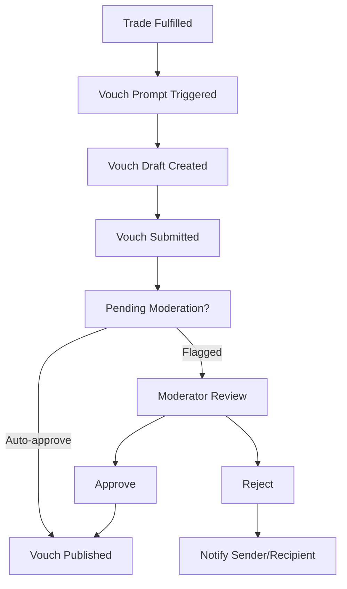

# Trust & Vouching

Meeple Cart depends on community reputation to keep trading safe and personable. The vouching system lets members endorse one another after successful exchanges and surfaces that trust across the product experience. This page captures how the feature works, which data models are involved, and the operational guardrails we rely on.

## Goals

- Give traders a lightweight way to thank partners and build verifiable reputation.
- Aggregate trust signals so listings, messages, and chain participation can highlight reliable users.
- Equip moderators with tooling to validate or revoke endorsements when disputes occur.

## Core concepts

- **Vouch (`vouches`)** – A short testimonial tied to a specific recipient and, optionally, the trade that inspired it. Vouches increase the recipient's `vouch_count`.
- **Trust score** – The combination of `vouch_count`, `trade_count`, and qualitative feedback shown on user profiles and trading surfaces.
- **Voucher eligibility** – To give vouches, users must have either: (1) received at least one vouch from another user, OR (2) completed phone verification via Trust Buddy. See [Trust Tiers](./reputation/trust-tiers.md) for details.
- **Vouch timing** – Users can vouch another participant only after at least one fulfilled trade (or approved trust event) between them.

## Lifecycle

1. **Trigger** – When a trade reaches `completed` (or a chain step transitions to `fulfilled`), both participants become eligible to vouch for each other. The UI surfaces prompts on the trade detail page, profile widgets, and post-trade notifications.
2. **Draft** – The giver selects a rating (optional) and writes a short testimonial. The system enforces a cooldown (e.g., one vouch per participant per trade) to prevent duplicates.
3. **Submission** – The vouch is saved to `vouches` with `voucher`, `vouchee`, `message`, optional `trade`, and timestamp.
4. **Moderation** – Most vouches auto-publish. Entries containing banned keywords, excessive links, or low reputation sources are queued for moderation before appearing publicly.
5. **Publication** – Once approved, the vouch is visible on the recipient’s profile, contributes to `vouch_count`, and may trigger notifications or emails.

## Vouching for Different Listing Types

### Trade & Sell Listings

Standard vouching flow: After the trade is marked complete, both parties can vouch each other. The seller ships the item, the buyer receives it, and vouches are exchanged based on the quality of the interaction (shipping speed, condition accuracy, communication, etc.).

### Want-to-Buy Listings

Want-to-buy listings work slightly differently:

1. **Buyer creates listing** – User A posts "Want to Buy: Wingspan" with their budget/trade offers
2. **Seller responds** – User B (who owns Wingspan) messages User A offering to sell
3. **Trade initiated** – They agree on terms and create a trade (User B = sender, User A = recipient)
4. **Completion** – After the game is delivered and payment exchanged, trade marked complete
5. **Vouching** – Both parties can vouch:
   - **Buyer (User A)** vouches seller for: item condition, shipping speed, communication
   - **Seller (User B)** vouches buyer for: prompt payment, clear communication, smooth transaction

**Key point:** Vouches are tied to trades, not listings. Regardless of listing type, once a trade is marked complete, both participants become eligible to vouch each other.

## Data model touchpoints

| Collection | Usage |
| ---------- | ----- |
| `vouches` | Stores individual testimonials. Fields: `voucher`, `vouchee`, `message`, `trade`, `created`. |
| `users` | Maintains aggregate counters (`vouch_count`, `trade_count`) and surfaces reputation in UI. |
| `trades` | Acts as the eligibility anchor; fulfilled trades unlock the vouch UI and optionally link the vouch. |
| `notifications` | Sends “You received a vouch” or “Your vouch was moderated” alerts. |

The data model reference in `development/data-models.md#vouches-vouches` includes the full schema for `vouches`.

## User experience

- **Prompt surfaces** – Success modals after trades, inbox messages, and the dashboard “Trust” widget highlight pending vouch opportunities.
- **Profile display** – The recipient’s profile shows a condensed list of recent vouches, aggregate stats, and badges unlocked at thresholds (e.g., “Trusted Trader” at 10 vouches).
- **Search filters** – Marketplace search can boost listings from users above configurable thresholds or let buyers filter for minimum vouch totals.
- **Chain coordination** – Chain steps may reference vouch counts when selecting recipients to ensure gifts go to established participants.

## Moderation & dispute handling

- **Auto-flagging** – Vouches containing profanity, external solicitation, or spam patterns are marked for review. Repeat offenders can lose vouching privileges temporarily.
- **Manual review** – Moderators can edit or remove vouches. Removal decrements the recipient’s `vouch_count` and records an audit note.
- **Disputes** – Recipients can report a vouch. Moderators investigate linked trades, convo transcripts, or chain steps before deciding.
- **Rate limiting** – System enforces daily caps to prevent brigading (e.g., 5 vouches per day per voucher).

## Implementation notes

- Expose PocketBase rules so only the `voucher`, `vouchee`, or moderators can view or manage pending vouches; published entries remain publicly readable.
- When vouches are deleted or edited, recompute `vouch_count` via a lightweight PocketBase function or scheduled job to keep aggregates consistent.
- Store moderation metadata (moderator id, reason) alongside the vouch record or in an audit log for accountability.
- Consider background jobs to remind users about unfulfilled vouch opportunities a few days after trade completion.

## Next steps

- Add UI specs/screens for the vouch prompt, profile module, and moderation dashboard to `spec/`.
- Define analytics events (e.g., `vouch_submitted`, `vouch_declined`) for retention cohorts.
- Explore tie-ins with badges or loyalty programs once we gather adoption data.

---

**Status:** Core functionality documented, vouching eligibility and workflows defined
**Last updated:** 2025-10-20
