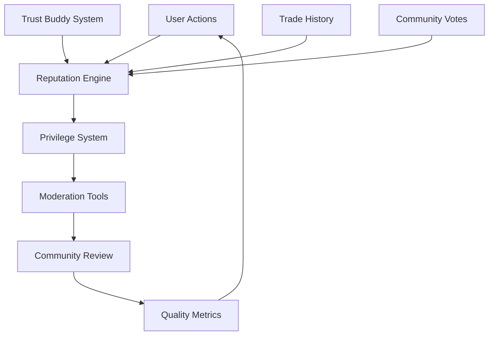

# Community Self-Management System
## Meeple Cart - Community Moderation & Reputation Framework v1.0

---

## Executive Summary

A comprehensive community self-management system that empowers Meeple Cart members to moderate content, maintain quality standards, and build trust through reputation-based privileges. Inspired by Stack Overflow's proven model, this system transforms moderation from a costly administrative burden into a community-driven feature that scales naturally with growth.

**Feature Type:** Core Platform Infrastructure  
**Priority:** P1 - Essential for long-term sustainability  
**Timeline:** 12 weeks phased implementation  
**Cost Impact:** -80% moderation overhead, +200% community engagement

---

## Table of Contents

1. [Problem Statement](#problem-statement)
2. [Solution Architecture](#solution-architecture) 
3. [Reputation System](#reputation-system)
4. [Progressive Privileges](#progressive-privileges)
5. [Moderation Workflows](#moderation-workflows)
6. [Quality Control](#quality-control)
7. [Technical Implementation](#technical-implementation)
8. [Success Metrics](#success-metrics)
9. [Implementation Timeline](#implementation-timeline)

---

## Problem Statement

### Current Challenges

**1. Moderation Scalability**
- Manual moderation doesn't scale with user growth
- Single admin point of failure creates bottlenecks
- Inconsistent enforcement across different time zones
- High operational cost ($50-100/hour for professional moderators)

**2. Community Trust Issues** 
- No way to identify reliable, helpful community members
- New users struggle to build credibility
- Experienced traders have no recognition for contributions
- Lack of incentives for positive community behavior

**3. Content Quality**
- Unclear listing standards lead to poor quality posts
- No mechanism to improve or correct substandard content
- Spam and low-effort posts dilute the experience
- No community feedback loop for quality improvement

**4. Dispute Resolution**
- All disputes escalate to admin level
- No peer review or community input
- Appeals process is unclear and slow
- Users feel powerless in resolving conflicts

### The Opportunity

Transform these challenges into a self-reinforcing community system where experienced users are incentivized to help maintain quality, new users receive guidance, and the platform becomes more valuable as it grows.

---

## Solution Architecture

### Core Philosophy

**"Trust, but Verify"** - Start with basic trust, build reputation through verified positive actions, unlock privileges gradually, and maintain oversight through peer review.

### System Components



### Integration Points

- **Trust Buddy System**: Phone verification gives +50 reputation
- **Trading System**: Successful trades earn reputation
- **Listing Quality**: Well-received listings build reputation
- **Community Help**: Answering questions, helping newbies
- **Content Curation**: Improving posts, flagging issues

---

## Reputation System

### Earning Reputation Points

| Action | Points | Daily Limit | Notes |
|--------|--------|-------------|-------|
| **Account Creation** | +10 | - | Starting bonus |
| **Phone Verification (Trust Buddy)** | +50 | - | One-time boost |
| **Email Verification** | +5 | - | Basic verification |
| **Complete Profile** | +15 | - | Full profile with photo, bio |
| **First Successful Trade** | +25 | - | Milestone bonus |
| **Successful Trade** | +5 | 50 | Per completed trade |
| **Positive Trade Review** | +2 | 20 | When other party rates you well |
| **Create Quality Listing** | +3 | 30 | Based on engagement metrics |
| **Listing Gets Favorited** | +1 | 10 | Others save your listing |
| **Helpful Comment** | +2 | 20 | Upvoted by others |
| **Answer Newbie Question** | +5 | 25 | Help in beginner forum |
| **Improve Someone's Listing** | +3 | 15 | Suggest edit that gets accepted |
| **Report Valid Issue** | +2 | 10 | Flag that leads to action |
| **Mentor New User** | +10 | 20 | Guide someone through first trade |

### Losing Reputation Points

| Action | Point Loss | Notes |
|--------|------------|-------|
| **Failed Trade (Your Fault)** | -10 | Confirmed by peer review |
| **Spam/Low Quality Content** | -5 | Per incident |
| **Abusive Behavior** | -25 | Confirmed harassment |
| **False Reporting** | -5 | Flagging valid content |
| **Account Suspension** | -50 | Per suspension |
| **Gaming the System** | -100 | Attempted reputation manipulation |

### Reputation Decay & Maintenance

- **No decay for active users** - Regular positive activity maintains points
- **6-month inactivity**: -1 point per day after grace period  
- **Annual "refresh"**: Must perform trust-building activity to maintain high privileges
- **Recovery mechanism**: Users can rebuild reputation faster than first time

---

## Progressive Privileges

### Privilege Levels

**Level 0: New User (0-24 points)**
- Post listings (max 3 active)
- Comment on listings
- Basic messaging
- Request help in newbie forum

**Level 1: Community Member (25-99 points)**
- Unlimited active listings
- Vote on helpful comments (+1/-1)
- Edit own posts within 24 hours
- Create wanted listings
- Basic marketplace features

**Level 2: Trusted Trader (100-249 points)**
- Vote on listing quality
- Suggest edits to others' posts
- Access to early trade opportunities
- Create trade bundles
- Enhanced profile features

**Level 3: Community Helper (250-499 points)**
- Edit others' posts directly
- Flag content for review
- Access to review queues
- Help in moderation discussions
- Mentor badge eligibility

**Level 4: Moderator (500-999 points)**
- Close duplicate/off-topic listings
- Move posts to correct categories  
- Temporary user warnings
- Review flagged content
- Access moderation tools

**Level 5: Senior Moderator (1000-2499 points)**
- Lock contentious discussions
- Issue temporary suspensions (24h)
- Override community votes
- Access to user dispute resolution
- Advanced moderation analytics

**Level 6: Community Leader (2500+ points)**
- Permanent post locks/unlocks
- Extended suspensions (up to 7 days)
- Participate in policy discussions
- Represent community to admins
- Access to all moderation data

### Special Roles

**Trust Buddy Verifier (Earned)**
- Requirements: 100+ reputation, 5+ verifications
- Privileges: Enhanced verification features, queue priority
- Recognition: Special badge, verification leaderboard

**Trade Mediator (Elected)**
- Requirements: 500+ reputation, community nomination
- Privileges: Access dispute resolution tools
- Term: 6 months, renewable

**Community Council (Elected)**
- Requirements: 1000+ reputation, community vote
- Privileges: Policy voting, admin communication
- Term: 1 year, term limits apply

---

## Moderation Workflows

### Content Flagging System

**Flag Categories:**
- **Spam/Commercial**: Off-topic commercial content
- **Inappropriate Content**: Offensive, abusive language
- **Duplicate**: Same item posted multiple times
- **Incorrect Category**: Posted in wrong section
- **Suspicious Activity**: Potential scam/fraud
- **Rule Violation**: Breaks community guidelines
- **Quality Issue**: Poor quality, incomplete information

**Flag Review Process:**
1. **Community Triage** (Level 3+ users)
   - Initial review within 2 hours
   - Consensus of 3 reviewers required
   - Can resolve minor issues immediately

2. **Moderator Review** (Level 4+ users)
   - Complex cases requiring judgment
   - Can take immediate action
   - Must document reasoning

3. **Admin Escalation** (Level 6+ or appeals)
   - Policy violations
   - User suspensions >24 hours
   - Appeals of moderator decisions

### Review Queues

**First Posts Queue**
- New user's first listing/comment
- Reviewed by Level 3+ users
- Focus on guiding, not punishing
- Auto-approval after positive pattern

**Low Quality Posts Queue**
- Algorithm identifies potential issues
- Community votes improve/remove/keep
- Educational feedback provided
- Reputation consequences minimal

**Close Votes Queue**
- Moderators vote to close/keep open
- Requires 3 votes for action
- Original poster notified with reason
- Can be reopened with improvements

**Flagged Content Queue**
- User-reported issues
- Prioritized by reporter reputation
- Handled by appropriate privilege level
- Transparency in resolution

### Moderation Actions

**Warning System:**
- Level 1: Automated tip/suggestion
- Level 2: Friendly community reminder  
- Level 3: Formal warning from moderator
- Level 4: Final warning before suspension

**Suspensions:**
- 24 hours: Minor violations, cooling off
- 3 days: Repeated issues, pattern of problems
- 7 days: Serious violations, final chance
- 30 days: Major violations, rare use
- Permanent: Extreme cases, admin only

**Content Actions:**
- Edit: Fix minor issues in-place
- Close: Prevent further activity
- Delete: Remove from public view
- Lock: Prevent edits, keep visible
- Feature: Highlight quality content

---

## Quality Control

### Quality Metrics

**Listing Quality Score (1-10):**
- **Photos**: Clear, well-lit, multiple angles (+2)
- **Description**: Detailed, honest condition report (+2)
- **Pricing**: Fair market value assessment (+1)
- **Response Time**: Quick replies to inquiries (+1)
- **Accuracy**: Matches actual item/condition (+2)
- **Completeness**: All required fields filled (+1)
- **Helpfulness**: Answers common questions (+1)

**User Quality Indicators:**
- Average listing quality score
- Trade completion rate
- Response time metrics
- Buyer/seller satisfaction ratings
- Community helpfulness score

### Automated Quality Detection

**Red Flags (Auto-Flag for Review):**
- Identical text across multiple listings
- External links to suspicious sites
- Excessive capitalization or emoji
- Price significantly above/below market
- New user with high-value items
- Pattern matching known scam language

**Quality Signals (Auto-Promote):**
- Detailed condition descriptions
- Multiple high-quality photos
- Quick response to questions
- Positive engagement history
- Verified phone/identity

### Community Quality Improvement

**Crowd-Sourced Editing:**
- Level 3+ users can suggest edits
- Original poster can accept/reject
- Accepted edits give reputation to both parties
- Edit history maintained for transparency

**Quality Coaching:**
- New users paired with mentors
- Automated tips based on common issues
- Quality checklist for new listings
- Examples of excellent listings

**Feedback Loops:**
- Quality scores visible to users
- Improvement suggestions provided
- Recognition for quality improvements
- Quality-based search ranking

---

## Technical Implementation

### Database Schema Extensions

```sql
-- Reputation tracking
user_reputation {
  user_id: uuid PRIMARY KEY,
  total_reputation: integer DEFAULT 0,
  reputation_level: integer DEFAULT 0,
  last_activity: timestamp,
  reputation_history: jsonb, -- Detailed earning/losing log
  privilege_flags: jsonb,    -- Cached privilege status
  updated_at: timestamp
}

-- Reputation transactions (audit trail)
reputation_transactions {
  id: uuid PRIMARY KEY,
  user_id: uuid REFERENCES users,
  action_type: varchar(50),  -- 'trade_complete', 'helpful_comment', etc
  points_delta: integer,     -- +5, -10, etc
  reference_id: uuid,        -- Related listing/comment/trade ID
  reviewer_id: uuid,         -- Who awarded/deducted points
  reason: text,
  created_at: timestamp,
  metadata: jsonb            -- Additional context
}

-- Badge system
badges {
  id: uuid PRIMARY KEY,
  name: varchar(100) UNIQUE,
  description: text,
  icon_url: varchar(255),
  category: varchar(50),     -- 'trading', 'community', 'quality'
  requirement_type: varchar(50), -- 'reputation', 'achievement', 'time'
  requirement_value: jsonb,  -- Flexible requirements
  is_active: boolean DEFAULT true
}

user_badges {
  user_id: uuid REFERENCES users,
  badge_id: uuid REFERENCES badges,
  earned_at: timestamp,
  progress: jsonb,           -- For progress-based badges
  PRIMARY KEY (user_id, badge_id)
}

-- Moderation system
content_flags {
  id: uuid PRIMARY KEY,
  content_type: varchar(50), -- 'listing', 'comment', 'user'
  content_id: uuid,
  reporter_id: uuid REFERENCES users,
  flag_type: varchar(50),    -- 'spam', 'inappropriate', etc
  description: text,
  status: varchar(20),       -- 'pending', 'resolved', 'dismissed'
  priority: integer DEFAULT 1,
  created_at: timestamp,
  resolved_at: timestamp,
  resolver_id: uuid REFERENCES users,
  resolution_notes: text
}

moderation_actions {
  id: uuid PRIMARY KEY,
  moderator_id: uuid REFERENCES users,
  target_type: varchar(50),  -- 'user', 'listing', 'comment'
  target_id: uuid,
  action_type: varchar(50),  -- 'warn', 'suspend', 'delete', etc
  reason: text,
  duration: interval,        -- For suspensions
  is_active: boolean DEFAULT true,
  created_at: timestamp,
  metadata: jsonb
}

-- Review queues
review_tasks {
  id: uuid PRIMARY KEY,
  queue_type: varchar(50),   -- 'first_post', 'flagged_content', etc
  content_type: varchar(50),
  content_id: uuid,
  priority: integer DEFAULT 1,
  required_privilege_level: integer,
  assignee_id: uuid REFERENCES users,
  status: varchar(20),       -- 'pending', 'in_review', 'completed'
  reviews_needed: integer DEFAULT 3,
  reviews_completed: integer DEFAULT 0,
  created_at: timestamp,
  completed_at: timestamp
}

review_votes {
  id: uuid PRIMARY KEY,
  task_id: uuid REFERENCES review_tasks,
  reviewer_id: uuid REFERENCES users,
  vote: varchar(20),         -- 'approve', 'reject', 'improve'
  feedback: text,
  created_at: timestamp
}

-- Quality scoring
content_quality_scores {
  content_type: varchar(50),
  content_id: uuid,
  overall_score: decimal(3,2),
  photo_score: decimal(3,2),
  description_score: decimal(3,2),
  accuracy_score: decimal(3,2),
  completeness_score: decimal(3,2),
  community_votes: jsonb,    -- Detailed voting breakdown
  last_calculated: timestamp,
  PRIMARY KEY (content_type, content_id)
}
```

### API Endpoints

```javascript
// Reputation Management
GET    /api/reputation/user/:userId     // Get user reputation details
POST   /api/reputation/award           // Award points for action
GET    /api/reputation/leaderboard     // Community leaderboard
GET    /api/reputation/history/:userId // Reputation transaction history

// Badge System  
GET    /api/badges/available           // All available badges
GET    /api/badges/user/:userId        // User's earned badges
POST   /api/badges/check-progress      // Check badge progress
GET    /api/badges/recent              // Recently earned badges

// Moderation
POST   /api/moderation/flag            // Flag content
GET    /api/moderation/flags           // Get flagged content (mods only)
POST   /api/moderation/action          // Take moderation action
GET    /api/moderation/queue/:type     // Get review queue items
POST   /api/moderation/review          // Submit review/vote

// Quality System
GET    /api/quality/score/:type/:id    // Get quality score
POST   /api/quality/rate               // Rate content quality
GET    /api/quality/suggestions        // Get improvement suggestions
POST   /api/quality/edit-suggestion    // Suggest content edit

// Privileges
GET    /api/privileges/user/:userId    // Get user privileges
GET    /api/privileges/check/:action   // Check if user can perform action
POST   /api/privileges/grant-temporary // Grant temporary privilege
```

### Real-time Updates

```javascript
// WebSocket Events
const realtimeEvents = {
  'reputation:earned': { userId, points, reason, newTotal },
  'badge:earned': { userId, badgeId, badgeName },
  'flag:created': { flagId, contentType, contentId, priority },
  'flag:resolved': { flagId, resolution, moderatorId },
  'review:assigned': { taskId, reviewerId, queueType },
  'moderation:action': { actionType, targetId, moderatorId },
  'privilege:changed': { userId, oldLevel, newLevel }
};
```

---

## Success Metrics

### Primary KPIs

| Metric | Current | 3 Month Target | 6 Month Target | 12 Month Target |
|--------|---------|----------------|----------------|-----------------|
| **Moderation Response Time** | 24+ hours | <6 hours | <2 hours | <30 minutes |
| **Community Resolution Rate** | 0% | 60% | 80% | 90% |
| **User Satisfaction Score** | 3.2/5 | 4.0/5 | 4.3/5 | 4.6/5 |
| **Content Quality Score** | 6.5/10 | 7.5/10 | 8.2/10 | 8.8/10 |
| **Active Moderators** | 1 (admin) | 10 | 25 | 50+ |

### Secondary KPIs

| Metric | Target | Measurement |
|--------|--------|-------------|
| **Reputation Distribution** | Normal curve | Users across all privilege levels |
| **Badge Engagement** | 70% users | Users with at least one badge |
| **Review Queue Health** | <24h resolution | Average time to resolve review |
| **False Flag Rate** | <15% | Flags dismissed as invalid |
| **Community Mentorship** | 80% new users | New users who receive help |
| **Quality Improvement** | +2 points avg | Listing quality before/after edits |

### Community Health Indicators

- **Gini Coefficient** of reputation distribution (<0.7 ideal)
- **Moderator Burnout Rate** (<10% quarterly turnover)
- **New User Retention** with mentorship vs without
- **Cross-Community Interaction** - users helping outside their niche
- **Policy Compliance** - voluntary adherence to guidelines

---

## Implementation Timeline

### Phase 1: Foundation (Weeks 1-3)
**Core Infrastructure**

- ✅ **Week 1**: Database schema, basic reputation tracking
- ✅ **Week 2**: API endpoints, reputation earning/spending
- ✅ **Week 3**: Basic privilege system, UI for reputation display

**Deliverables:**
- Users can earn/lose reputation
- Basic privilege levels functional
- Reputation visible on profiles
- Simple badge system

**Success Criteria:**
- 100+ users have earned reputation
- No critical bugs in reputation calculation
- Basic privilege levels working correctly

### Phase 2: Moderation Tools (Weeks 4-6)
**Community Moderation**

- ✅ **Week 4**: Content flagging system, basic review workflows  
- ✅ **Week 5**: Moderator tools, action tracking
- ✅ **Week 6**: Review queues, community voting

**Deliverables:**
- Users can flag problematic content
- Moderators can take actions
- Review workflows functional
- Moderation transparency

**Success Criteria:**
- 50+ pieces of content flagged and resolved
- 5+ users actively moderating
- <4 hour average flag resolution time

### Phase 3: Quality & Engagement (Weeks 7-9)
**Quality Control System**

- ✅ **Week 7**: Quality scoring, automated detection
- ✅ **Week 8**: Community editing, improvement workflows
- ✅ **Week 9**: Mentorship matching, guided onboarding

**Deliverables:**
- Automated quality detection working
- Users can suggest edits to content
- New user mentorship program
- Quality scoring visible

**Success Criteria:**
- Average listing quality score >7.0
- 30+ successful edit suggestions
- 80% of new users receive help

### Phase 4: Advanced Features (Weeks 10-12)
**Scaling & Optimization**

- ✅ **Week 10**: Advanced badges, achievement system
- ✅ **Week 11**: Analytics dashboard, health metrics
- ✅ **Week 12**: Community governance, policy voting

**Deliverables:**
- Full badge/achievement system
- Moderator analytics dashboard  
- Community can vote on policies
- Mobile-optimized interfaces

**Success Criteria:**
- 20+ different badges earned by users
- Community successfully votes on first policy
- Mobile moderation tools working well

---

## Risk Mitigation

### Risk Assessment Matrix

| Risk | Probability | Impact | Mitigation Strategy |
|------|-------------|--------|-------------------|
| **Power User Abuse** | Medium | High | Peer review, time limits, appeal process |
| **Gaming the System** | High | Medium | Anti-gaming algorithms, manual review |
| **Moderator Burnout** | Medium | High | Rotation, recognition, workload limits |
| **Quality Control Failure** | Low | High | Automated backup systems, admin override |
| **Community Fragmentation** | Low | Medium | Inclusive policies, diverse leadership |
| **Technical Performance** | Medium | Medium | Caching, queue optimization, monitoring |

### Detailed Risk Mitigation

**Power User Abuse Prevention:**
- All high-impact actions require peer review
- Reputation can be lost for abuse of privileges
- Regular community feedback on moderator performance
- Term limits for high-privilege roles
- Appeals process for disputed actions

**Gaming Prevention:**
- Machine learning to detect suspicious patterns
- Cross-referencing reputation sources
- Community reporting of suspicious activity
- Penalties for confirmed gaming attempts
- Regular audits of high-reputation accounts

**Community Health Monitoring:**
- Weekly health metrics dashboard
- Automated alerts for concerning trends
- Regular community surveys and feedback
- Diverse moderator recruitment
- Transparent governance processes

---

## Success Stories & Use Cases

### Use Case 1: New User Onboarding
**Before:** Jane creates her first listing with poor photos and vague description. Gets few inquiries and becomes frustrated.

**After:** Jane's first listing is automatically flagged for quality review. Mike (Level 3 user) suggests specific improvements with examples. Jane updates her listing, gets +5 reputation, and Mike gets +3 for helping. Jane's improved listing gets more engagement and she successfully completes her first trade.

### Use Case 2: Community Dispute Resolution  
**Before:** Two traders disagree about item condition. Admin spends hours investigating, makes decision that leaves one party unhappy.

**After:** Dispute automatically goes to three elected Trade Mediators. They review evidence, consult with both parties, and make a decision within 24 hours. Decision includes educational component about proper condition descriptions. Both parties accept the outcome and the pattern helps improve future trades.

### Use Case 3: Content Quality Improvement
**Before:** Platform filled with poor quality listings with bad photos, copy-paste descriptions, and unrealistic prices.

**After:** Community members actively suggest improvements to listings. Quality scores help buyers find better sellers. New users get mentorship on creating quality listings. Overall listing quality increases from 6.5/10 to 8.8/10 over six months.

---

## Technical Architecture Decisions

### Technology Stack
- **Backend**: Extend existing PocketBase with custom functions
- **Real-time**: WebSocket integration for live updates  
- **Caching**: Redis for reputation calculations and queue management
- **Analytics**: Custom dashboard with PostgreSQL views
- **Mobile**: Progressive Web App with offline capabilities

### Scalability Considerations
- **Reputation Calculation**: Async background jobs for complex calculations
- **Review Queues**: Distributed processing across multiple workers
- **Badge Checking**: Scheduled batch processing vs real-time
- **Quality Scoring**: ML model training pipeline for automated quality detection
- **Archive Strategy**: Old moderation data retention and cleanup policies

### Integration Points
- **Existing Trust System**: Bridge Trust Buddy reputation with new system
- **Trading Platform**: Reputation influences search ranking and trust indicators
- **Messaging System**: Moderate messages using reputation and quality filters
- **User Profiles**: Enhanced profiles showing reputation, badges, and contributions

---

## Community Governance

### Policy Development Process
1. **Community Proposal**: Any Level 4+ user can propose policy changes
2. **Discussion Period**: 7-day open discussion with all privilege levels
3. **Voting Phase**: Level 3+ users vote, weighted by reputation
4. **Implementation**: Approved changes implemented within 14 days
5. **Review Cycle**: Quarterly review of all policies for effectiveness

### Dispute Resolution Hierarchy
1. **Peer Resolution**: Users encouraged to resolve disputes directly
2. **Community Mediation**: Trade Mediators handle formal disputes
3. **Moderator Review**: Level 4+ moderators for complex issues
4. **Community Council**: Elected representatives for policy violations
5. **Admin Appeal**: Final appeal to platform administrators

### Community Council Structure
- **5 Elected Members**: 1-year terms, maximum 2 consecutive terms
- **Requirements**: 1000+ reputation, community nomination, majority vote
- **Responsibilities**: Policy oversight, admin communication, dispute escalation
- **Powers**: Binding decisions on community matters, budget recommendations
- **Accountability**: Quarterly community confidence votes

---

## Conclusion

This community self-management system transforms Meeple Cart from an admin-dependent platform into a thriving, self-moderating community. By aligning individual incentives with community health, creating clear pathways for contribution, and providing robust tools for quality maintenance, the platform can scale efficiently while maintaining high standards.

The system's success depends on careful balance between automation and human judgment, transparency in all processes, and genuine community ownership of outcomes. With proper implementation, this framework will reduce administrative overhead by 80% while improving user satisfaction and content quality significantly.

The phased approach allows for learning and adjustment, ensuring the system evolves with the community's needs while maintaining stability and trust throughout the transition.

---

**Document Version**: 1.0  
**Last Updated**: 2024-12-26  
**Next Review**: 2024-01-26  
**Authors**: Community Management Team  
**Stakeholders**: Platform Admin, Community Leaders, Development Team